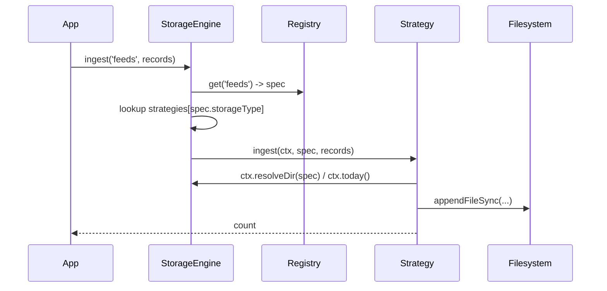

# Architecture

## Module map

```
src/
├── spec.mjs           DataSourceSpec + DataSourceRegistry (declarative metadata)
├── time.mjs           tz-aware date helpers (nowInTz / todayInTz / dateStrDaysAgo)
├── io.mjs             file primitives (atomic write, jsonl read/append, cleanup)
├── engine.mjs         StorageEngine (router, path resolver, context builder)
├── strategies/
│   ├── single-json.mjs
│   ├── entity-json.mjs
│   ├── entity-jsonl.mjs
│   ├── append-jsonl.mjs
│   └── daily-jsonl.mjs
└── index.mjs          public re-exports
```

## Concepts

**DataSourceSpec** — a frozen, declarative description of one data source:
its name, storageType, optional `subdir`, `filename`, `retentionDays`,
`dedupKey`, and an optional `observerId` that callers can use to refer to the
spec from outside (e.g. for an observation/discovery system).

**DataSourceRegistry** — a `Map<name, DataSourceSpec>` with bulk-register and
lookup helpers. Carries no defaults; you bring your own spec catalog.

**Strategy** — a tiny module exporting `{ ingest, read, cleanup, dedupIds }`.
Strategies do not know about `baseDir`, `timezone`, or the registry; they
receive a `StrategyContext` from the engine.

**StorageEngine** — the only stateful object. Owns:

- `baseDir`: root directory under which all data lives
- `registry`: which sources exist
- `timezone`: used for date partitioning and ISO timestamps
- `logger`: pluggable; defaults to `console.error`
- a frozen `_ctx` (StrategyContext) that wraps the above as small functions:
  `now()`, `today()`, `dateStrDaysAgo(n)`, `resolveDir(spec)`,
  `resolveFile(spec)`, `safeFilename(name)`.

## Data flow



## Path resolution

Given a spec, the engine resolves files like this:

| spec field         | result                                          |
|--------------------|-------------------------------------------------|
| `subdir = ''`      | files live directly in `baseDir`                |
| `subdir = null`    | files live in `baseDir/<spec.name>/`            |
| `subdir = 'foo'`   | files live in `baseDir/foo/`                    |
| `filename = 'x.json'` | single_json / append_jsonl write that file   |
| no `filename` for `single_json` | `<dir>/<spec.name>.json`            |
| no `filename` for `append_jsonl` | `<dir>/<spec.name>.jsonl`          |

Daily files always use `<dir>/YYYY-MM-DD.jsonl` (date in engine timezone).

Entity-json uses `<dir>/<safeName>.json` where unsafe characters
(`/`, `\`, `..`, space, NUL) are mapped to `_`.

## Atomicity

Single-file writes (`single_json`, full-rewrite paths) go through
`atomicWriteJson`: write to `<file>.tmp`, then `rename` over the target. On
POSIX file systems this is atomic.

Appends (`append_jsonl`, `daily_jsonl`, `entity_jsonl`) use
`appendFileSync` directly. Append on a single FD is safe within one process;
cross-process concurrency is **not** protected (file locks are a planned
feature — see CHANGELOG).

## Timezone handling

`time.mjs` uses `Intl.DateTimeFormat` to derive a UTC offset for any IANA
timezone at any instant, so daily partition filenames and `updated_at` /
`first_seen` / `last_seen` timestamps consistently follow the engine's
configured zone. Default is `UTC`.

## Extending

Pass `strategies: { my_type: myStrategyModule }` to the engine constructor to
add or override a strategy. A strategy module must export an object with:

```typescript
{
  storageType: string,
  ingest(ctx, spec, payload): number,
  read(ctx, spec, opts): any,
  cleanup(ctx, spec): number,
  dedupIds(ctx, spec): Set<string>,
}
```

This is also how you can mock storage entirely in tests.
